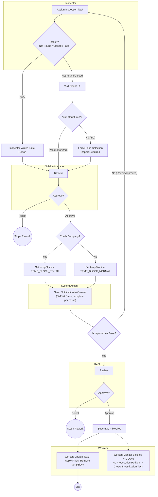

# New Flow — Enums, Youth Logic, and Two Revisits

This is the **target flow** with business rules: `tempBlock` and `blocked` are **enums**, two revisits maximum, and special handling for **Youth** companies at temporary block stage.

## Step-by-Step

1.  **Inspector** performs an inspection and marks a result.
2.  **Division Manager Review**: The case is sent to the Division Manager for review.
3.  **DM Decision & Actions**:
    -   If the DM **rejects** the case → process stops or is sent for rework.
    -   If the DM **approves** the case:
        1.  The company is set to `tempBlock` (with special handling for `Youth` companies).
        2.  A **notification is sent** to the company owners.
4.  **Post-Approval Flow**:
    -   **For "Fake" reports**: The case moves to the **HCM** for final review.
    -   **For "Not Found / Closed" (1st/2nd visit)**: A **revisit is scheduled**, and the inspection flow begins again.
5.  **HCM Review (for Fake Reports only):**
    -   If approved → company becomes `blocked`.
6.  **Worker 1** updates Taziz, applies fines, removes `tempBlock`.
7.  **Worker 2** monitors for long-term blocked cases (>40 days).

## Flow (Mermaid)

## Enum States

- `tempBlock` ∈ { `TEMP_BLOCK_YOUTH`, `TEMP_BLOCK_NORMAL` }
- `blocked` is the final permanent state set after HCM approval.
