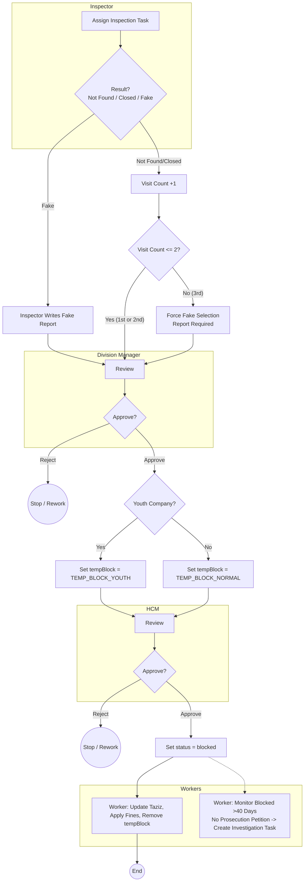

# New Flow — Enums, Youth Logic, and Two Revisits

This is the **target flow** with business rules: `tempBlock` and `blocked` are **enums**, two revisits maximum, and special handling for **Youth** companies at temporary block stage.

## Step-by-Step

1. **Inspector** marks result (Not Found / Closed / Fake).
2. **Division Manager** reviews:
    - If rejected → stop/rework.
    - If approved → company is set to `tempBlock` (Youth or Normal).
3. **Revisit rules:**
    - 1st inspection → revisit if Not Found/Closed.
    - 2nd inspection → revisit if Not Found/Closed.
    - 3rd inspection → must mark **Fake** + Report.
4. **HCM** reviews:
    - If approved → company becomes `blocked`.
5. **Worker 1** updates Taziz, applies fines, removes `tempBlock`.
6. **Worker 2** monitors for long-term blocked cases (>40 days).

## Flow (Mermaid)

## Enum States

- `tempBlock` ∈ { `TEMP_BLOCK_YOUTH`, `TEMP_BLOCK_NORMAL` }
- `blocked` is the final permanent state set after HCM approval.
